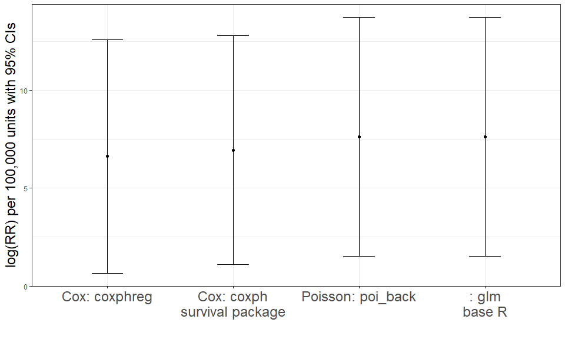

EpiFunctions
================

- [Installation](#installation)
- [Data format](#data-format)
  - [Person File](#person-file)
  - [History File](#history-file)
- [Cox Regression](#cox-regression)
- [Background Stratified Poisson
  Regression](#background-stratified-poisson-regression)

<!-- README.md is generated from README.Rmd. Please edit that file -->
<!-- badges: start -->
<!-- badges: end -->

The goal of EpiFunctions is to provide a set of functions to perform
survival analysis regressions not found elsewhere. In particular,
background stratified Poisson regression, as described in Richardson and
Langholz (2012), and matched Cox regression. Both regressions allow for
specification of the relative risk (RR) function as the traditional
log-linear from: \[RR = exp(b \* exposure)\] as well as a linear form:
\[RR = (1 + b \* exposure)\] commonly used in radiation research to
cacluate Excess Relative Risk (ERR). Additionally, it provides options
for the calculation of profile likelihood confidence intervals (vs the
traditional Wald-based confidence intervales).

Additionally, tools are provided to implement each regression in the
presence of time-dependent exposures.

## Installation

You can install the development version of EpiFunctions from
[GitHub](https://github.com/) with:

``` r
# install.packages("devtools")
devtools::install_github("bertkesj/EpiFunctions")
```

## Data format

### Person File

A person file is required to run most analyses where each row represents
one person and contains the following information:

<table class="table table-striped" style="width: auto !important; margin-left: auto; margin-right: auto;">
<thead>
<tr>
<th style="text-align:left;">
Variable
</th>
<th style="text-align:left;">
Description
</th>
<th style="text-align:left;">
Format
</th>
</tr>
</thead>
<tbody>
<tr>
<td style="text-align:left;">
id
</td>
<td style="text-align:left;">
Unique identifier for each person
</td>
<td style="text-align:left;">
</td>
</tr>
<tr>
<td style="text-align:left;">
sex
</td>
<td style="text-align:left;">
Sex of person (“M” = male / “F” = female)
</td>
<td style="text-align:left;">
character
</td>
</tr>
<tr>
<td style="text-align:left;">
race
</td>
<td style="text-align:left;">
Race of person (“W” = white / “N” = nonwhite)
</td>
<td style="text-align:left;">
character
</td>
</tr>
<tr>
<td style="text-align:left;">
dob
</td>
<td style="text-align:left;">
date of birth
</td>
<td style="text-align:left;">
date
</td>
</tr>
<tr>
<td style="text-align:left;">
pybegin
</td>
<td style="text-align:left;">
date to begin follow-up
</td>
<td style="text-align:left;">
date
</td>
</tr>
<tr>
<td style="text-align:left;">
dlo
</td>
<td style="text-align:left;">
date last observed. Minimum of end of study, date of death, date lost to
follow-up
</td>
<td style="text-align:left;">
date
</td>
</tr>
<tr>
<td style="text-align:left;">
…
</td>
<td style="text-align:left;">
Additional variable(s) defining death/incidence outcome
</td>
<td style="text-align:left;">
…
</td>
</tr>
</tbody>
</table>

EpiFunctions comes with a ‘dummy’ person data.frame, named
`example_person` for illustration and testing.

<table class="table table-striped" style="width: auto !important; margin-left: auto; margin-right: auto;">
<thead>
<tr>
<th style="text-align:left;">
id
</th>
<th style="text-align:left;">
race
</th>
<th style="text-align:left;">
gender
</th>
<th style="text-align:left;">
dob
</th>
<th style="text-align:left;">
pybegin
</th>
<th style="text-align:left;">
dlo
</th>
<th style="text-align:left;">
lung_cancer
</th>
</tr>
</thead>
<tbody>
<tr>
<td style="text-align:left;">
1
</td>
<td style="text-align:left;">
W
</td>
<td style="text-align:left;">
F
</td>
<td style="text-align:left;">
1940-07-23
</td>
<td style="text-align:left;">
1975-08-19
</td>
<td style="text-align:left;">
2022-02-21
</td>
<td style="text-align:left;">
FALSE
</td>
</tr>
<tr>
<td style="text-align:left;">
2
</td>
<td style="text-align:left;">
W
</td>
<td style="text-align:left;">
M
</td>
<td style="text-align:left;">
1926-11-25
</td>
<td style="text-align:left;">
1964-07-09
</td>
<td style="text-align:left;">
2017-02-22
</td>
<td style="text-align:left;">
FALSE
</td>
</tr>
<tr>
<td style="text-align:left;">
3
</td>
<td style="text-align:left;">
W
</td>
<td style="text-align:left;">
M
</td>
<td style="text-align:left;">
1933-07-10
</td>
<td style="text-align:left;">
1967-04-05
</td>
<td style="text-align:left;">
1997-03-29
</td>
<td style="text-align:left;">
FALSE
</td>
</tr>
<tr>
<td style="text-align:left;">
4
</td>
<td style="text-align:left;">
W
</td>
<td style="text-align:left;">
M
</td>
<td style="text-align:left;">
1935-07-05
</td>
<td style="text-align:left;">
1961-11-23
</td>
<td style="text-align:left;">
2022-02-28
</td>
<td style="text-align:left;">
FALSE
</td>
</tr>
<tr>
<td style="text-align:left;">
5
</td>
<td style="text-align:left;">
W
</td>
<td style="text-align:left;">
M
</td>
<td style="text-align:left;">
1936-11-09
</td>
<td style="text-align:left;">
1969-06-26
</td>
<td style="text-align:left;">
2021-11-28
</td>
<td style="text-align:left;">
FALSE
</td>
</tr>
<tr>
<td style="text-align:left;">
6
</td>
<td style="text-align:left;">
W
</td>
<td style="text-align:left;">
M
</td>
<td style="text-align:left;">
1938-07-26
</td>
<td style="text-align:left;">
1968-08-13
</td>
<td style="text-align:left;">
2016-11-26
</td>
<td style="text-align:left;">
FALSE
</td>
</tr>
</tbody>
</table>

Currently in this file, dates are saved as characters, sex is contained
in a variable named `gender` and the outcome variable is named
`lung_cancer`. These will need to be adjusted before most analyses (See
next sections).

### History File

Information on a time-dependent covariate (aside from age and calendar
period) will be contained in a history file. This file contains one row
per person per exposure period. An exposure period is a period of time
in which all daily values/levels of an exposure variable are assumed to
be constant.

Below are the required variables to be found within the history file:

<table class="table table-striped" style="width: auto !important; margin-left: auto; margin-right: auto;">
<thead>
<tr>
<th style="text-align:left;">
Variable
</th>
<th style="text-align:left;">
Description
</th>
<th style="text-align:left;">
Format
</th>
</tr>
</thead>
<tbody>
<tr>
<td style="text-align:left;">
id
</td>
<td style="text-align:left;">
Unique identifier for each person
</td>
<td style="text-align:left;">
</td>
</tr>
<tr>
<td style="text-align:left;">
begin_dt
</td>
<td style="text-align:left;">
Beginning date of exposure period
</td>
<td style="text-align:left;">
character
</td>
</tr>
<tr>
<td style="text-align:left;">
end_dt
</td>
<td style="text-align:left;">
End date of exposure period
</td>
<td style="text-align:left;">
character
</td>
</tr>
<tr>
<td style="text-align:left;">
&lt;daily exposure variables&gt;
</td>
<td style="text-align:left;">
Exposure variable(s)
</td>
<td style="text-align:left;">
numeric
</td>
</tr>
</tbody>
</table>

Again, EpiFunctions comes with a ‘dummy’ history file, named
`example_history`, for illustration and testing.

Below are the entries for person id ‘198’ in the `example_history`
file:  
<table class="table table-striped" style="width: auto !important; margin-left: auto; margin-right: auto;">
<thead>
<tr>
<th style="text-align:left;">
id
</th>
<th style="text-align:left;">
begin_dt
</th>
<th style="text-align:left;">
end_dt
</th>
<th style="text-align:left;">
daily_exposure
</th>
</tr>
</thead>
<tbody>
<tr>
<td style="text-align:left;">
198
</td>
<td style="text-align:left;">
1981-04-06
</td>
<td style="text-align:left;">
1981-12-31
</td>
<td style="text-align:left;">
6.5494
</td>
</tr>
<tr>
<td style="text-align:left;">
198
</td>
<td style="text-align:left;">
1982-01-01
</td>
<td style="text-align:left;">
1982-12-31
</td>
<td style="text-align:left;">
4.4584
</td>
</tr>
<tr>
<td style="text-align:left;">
198
</td>
<td style="text-align:left;">
1983-01-01
</td>
<td style="text-align:left;">
1983-12-31
</td>
<td style="text-align:left;">
1.0944
</td>
</tr>
<tr>
<td style="text-align:left;">
198
</td>
<td style="text-align:left;">
1984-01-01
</td>
<td style="text-align:left;">
1984-12-31
</td>
<td style="text-align:left;">
0.5824
</td>
</tr>
<tr>
<td style="text-align:left;">
198
</td>
<td style="text-align:left;">
1985-01-01
</td>
<td style="text-align:left;">
1985-07-08
</td>
<td style="text-align:left;">
0
</td>
</tr>
</tbody>
</table>

Again, dates are saved as characters and will need to be converted.

The above person’s history file entry contains 5 exposure periods, one
of which was unexposed. Below plots their cumulative exposure (which
starts at 0) over time:  


Note that cumulative exposure increases by 6.5 units per day and the
rate of increase drops to 0.6 units per day towards the end of their
exposure history.

**NOTE:** Any gaps within the history file and the follow-up times (for
example, the period between the last exposure period within the history
file through the end of follow-up) are assumed to be 0. That is,
cumulative exposure does not change during these periods.

## Cox Regression

To perform Cox regression, first risk-sets must be assembled. The
function `gt_rs()` will read in the person file (which is required to
contain id, race, sex, dob, pybegin, dlo) and also requires a variable
called `case` that takes a TRUE/FALSE value identifying the cases of
interest.

``` r
library(EpiFunctions)
risk_sets <- example_person %>%
  mutate(dob = as.Date(dob),
         pybegin = as.Date(pybegin),
         dlo = as.Date(dlo),
         
         sex = gender, #renaming gender to sex
         
         case = (lung_cancer == 'TRUE')) %>%
  gt_rs()
```

<table class="table table-striped" style="width: auto !important; margin-left: auto; margin-right: auto;">
<thead>
<tr>
<th style="text-align:left;">
case_id
</th>
<th style="text-align:left;">
id
</th>
<th style="text-align:left;">
case
</th>
<th style="text-align:left;">
cut_dt
</th>
</tr>
</thead>
<tbody>
<tr>
<td style="text-align:left;">
36
</td>
<td style="text-align:left;">
3
</td>
<td style="text-align:left;">
FALSE
</td>
<td style="text-align:left;">
1994-03-29
</td>
</tr>
<tr>
<td style="text-align:left;">
36
</td>
<td style="text-align:left;">
4
</td>
<td style="text-align:left;">
FALSE
</td>
<td style="text-align:left;">
1996-03-23
</td>
</tr>
<tr>
<td style="text-align:left;">
36
</td>
<td style="text-align:left;">
5
</td>
<td style="text-align:left;">
FALSE
</td>
<td style="text-align:left;">
1997-07-29
</td>
</tr>
<tr>
<td style="text-align:left;">
36
</td>
<td style="text-align:left;">
6
</td>
<td style="text-align:left;">
FALSE
</td>
<td style="text-align:left;">
1999-04-14
</td>
</tr>
<tr>
<td style="text-align:left;">
36
</td>
<td style="text-align:left;">
15
</td>
<td style="text-align:left;">
FALSE
</td>
<td style="text-align:left;">
1992-11-26
</td>
</tr>
<tr>
<td style="text-align:left;">
36
</td>
<td style="text-align:left;">
23
</td>
<td style="text-align:left;">
FALSE
</td>
<td style="text-align:left;">
1995-10-10
</td>
</tr>
<tr>
<td style="text-align:left;">
36
</td>
<td style="text-align:left;">
29
</td>
<td style="text-align:left;">
FALSE
</td>
<td style="text-align:left;">
1998-05-18
</td>
</tr>
<tr>
<td style="text-align:left;">
36
</td>
<td style="text-align:left;">
34
</td>
<td style="text-align:left;">
FALSE
</td>
<td style="text-align:left;">
1991-02-19
</td>
</tr>
<tr>
<td style="text-align:left;">
36
</td>
<td style="text-align:left;">
36
</td>
<td style="text-align:left;">
TRUE
</td>
<td style="text-align:left;">
1995-07-18
</td>
</tr>
<tr>
<td style="text-align:left;">
36
</td>
<td style="text-align:left;">
44
</td>
<td style="text-align:left;">
FALSE
</td>
<td style="text-align:left;">
1992-03-04
</td>
</tr>
</tbody>
</table>

The above risk sets use age as the time-scale. The `case_id` indicates
the index case and `cut_dt` indicates the date the given person (`id`)
attains the age of the index case. This date is used when evaluating
time-dependent covariates.

**NOTE:** The risk-sets are ‘matched’ on sex, race and birth-date (+/- 5
years) by default and therefore, these confounders do not need to be
explicitly controlled for in any regression.

Once the risk-sets are formed, they can be merged to the person file to
add additional confounders of interest. To add time-dependent exposures
found in the history file, the helper function `cum_exp()` function is
useful.

Below merges the history file with the risk_sets and calculates
cumulative exposure up to the `cut_dt` with a 0 and 10 year lag:

``` r
risk_sets <- example_history %>%
  mutate(begin_dt = as.Date(begin_dt),
         end_dt= as.Date(end_dt),
         
         daily_exposure = as.numeric(daily_exposure)) %>%
  right_join(risk_sets,
             by='id',
             relationship = 'many-to-many') %>%
  mutate(cumulative_exposure_lag0 = cum_exp(daily_exposure, 
                                             begin_dt, end_dt, cut_dt, 0),
         cumulative_exposure_lag10 = cum_exp(daily_exposure, 
                                             begin_dt, end_dt, cut_dt, 10)) %>%
  group_by(case_id, id, case, cut_dt) %>%
  dplyr::summarize(cumulative_exposure_lag0 = sum(cumulative_exposure_lag0),
                   cumulative_exposure_lag10 = sum(cumulative_exposure_lag10),
                   .groups='drop')
```

<table class="table table-striped" style="width: auto !important; margin-left: auto; margin-right: auto;">
<thead>
<tr>
<th style="text-align:left;">
case_id
</th>
<th style="text-align:left;">
id
</th>
<th style="text-align:left;">
case
</th>
<th style="text-align:left;">
cut_dt
</th>
<th style="text-align:right;">
cumulative_exposure_lag0
</th>
<th style="text-align:right;">
cumulative_exposure_lag10
</th>
</tr>
</thead>
<tbody>
<tr>
<td style="text-align:left;">
36
</td>
<td style="text-align:left;">
3
</td>
<td style="text-align:left;">
FALSE
</td>
<td style="text-align:left;">
1994-03-29
</td>
<td style="text-align:right;">
942.7026
</td>
<td style="text-align:right;">
942.7026
</td>
</tr>
<tr>
<td style="text-align:left;">
36
</td>
<td style="text-align:left;">
4
</td>
<td style="text-align:left;">
FALSE
</td>
<td style="text-align:left;">
1996-03-23
</td>
<td style="text-align:right;">
570.1516
</td>
<td style="text-align:right;">
570.1516
</td>
</tr>
<tr>
<td style="text-align:left;">
36
</td>
<td style="text-align:left;">
5
</td>
<td style="text-align:left;">
FALSE
</td>
<td style="text-align:left;">
1997-07-29
</td>
<td style="text-align:right;">
8421.7476
</td>
<td style="text-align:right;">
8421.7476
</td>
</tr>
<tr>
<td style="text-align:left;">
36
</td>
<td style="text-align:left;">
6
</td>
<td style="text-align:left;">
FALSE
</td>
<td style="text-align:left;">
1999-04-14
</td>
<td style="text-align:right;">
1798.7316
</td>
<td style="text-align:right;">
1798.7316
</td>
</tr>
<tr>
<td style="text-align:left;">
36
</td>
<td style="text-align:left;">
15
</td>
<td style="text-align:left;">
FALSE
</td>
<td style="text-align:left;">
1992-11-26
</td>
<td style="text-align:right;">
300.2190
</td>
<td style="text-align:right;">
300.2190
</td>
</tr>
<tr>
<td style="text-align:left;">
36
</td>
<td style="text-align:left;">
23
</td>
<td style="text-align:left;">
FALSE
</td>
<td style="text-align:left;">
1995-10-10
</td>
<td style="text-align:right;">
3052.0560
</td>
<td style="text-align:right;">
3052.0560
</td>
</tr>
<tr>
<td style="text-align:left;">
36
</td>
<td style="text-align:left;">
29
</td>
<td style="text-align:left;">
FALSE
</td>
<td style="text-align:left;">
1998-05-18
</td>
<td style="text-align:right;">
424.6316
</td>
<td style="text-align:right;">
424.6316
</td>
</tr>
<tr>
<td style="text-align:left;">
36
</td>
<td style="text-align:left;">
34
</td>
<td style="text-align:left;">
FALSE
</td>
<td style="text-align:left;">
1991-02-19
</td>
<td style="text-align:right;">
10300.5239
</td>
<td style="text-align:right;">
9177.8791
</td>
</tr>
<tr>
<td style="text-align:left;">
36
</td>
<td style="text-align:left;">
36
</td>
<td style="text-align:left;">
TRUE
</td>
<td style="text-align:left;">
1995-07-18
</td>
<td style="text-align:right;">
11775.4952
</td>
<td style="text-align:right;">
11775.4952
</td>
</tr>
<tr>
<td style="text-align:left;">
36
</td>
<td style="text-align:left;">
44
</td>
<td style="text-align:left;">
FALSE
</td>
<td style="text-align:left;">
1992-03-04
</td>
<td style="text-align:right;">
19026.8190
</td>
<td style="text-align:right;">
19026.8190
</td>
</tr>
</tbody>
</table>

To perform Cox regression on these risk-sets, the `coxphreg()` function
is used. Below calculates log(HR) for a lagged 10 exposure. Note, due to
the high value of exposures, these values are scaled and the below
represent log(HR) per 100,000 unit increase in dose, matched on age,
race, sex, birth-cohort:

``` r
coxphreg(risk_sets,
         loglin = ~ scale(cumulative_exposure_lag10, scale = 100000))
#> $output
#> # A tibble: 1 × 6
#>   var                                             est    se lower upper gradient
#>   <chr>                                         <dbl> <dbl> <lgl> <lgl>    <dbl>
#> 1 scale(cumulative_exposure_lag10, scale = 1e+…  6.62  3.05 NA    NA     2.13e-8
#> 
#> $neg2LL
#> [1] 185.2921
#> 
#> $AIC
#> [1] 187.2921
#> 
#> $hessian
#>            [,1]
#> [1,] -0.1075987
```

Note that this can also be accomplished through the use of the
`survival` package, where matching on race, sex and birth cohort being
the equivalent of a stratified Cox regression on these variables.
However, the `survival` package does not allow for specification of the
hazard ratio with a linear term (i.e. ERR calculation).

Additionally, `EpiFunctions` matches on birth dates within 5 years of
the index case (known as caliper matching), whereas stratified Cox
regression with the `survival` package defines fixed categories. See
“Modern Epidemiology” (Ahlbom et al., 2021) for further discussion of
this difference. Below nearly replicates the above analysis (with birth
cohort instead controlled for through defining fixed 10-year
categories):

``` r
library(lubridate)
#> 
#> Attaching package: 'lubridate'
#> The following objects are masked from 'package:base':
#> 
#>     date, intersect, setdiff, union
library(survival)
person <- person %>%
  mutate(age_begin = difftime(pybegin, dob, units = 'days') %>%
           as.numeric() %>%
           `/`(365.25),
         age_end = difftime(dlo, dob, units = 'days') %>%
           as.numeric() %>%
           `/`(365.25),
         birth_cat = 10*floor(year(dob)/10))
event_times <- person %>%
  filter(lung_cancer == 'TRUE') %>%
  `$`(age_end) %>%
  sort()
person_time <- person %>%
  mutate(event_times = list(event_times)) %>%
  unnest(event_times) %>%
  filter(age_begin <= event_times & event_times <= age_end) %>%
  group_by(id) %>%
  mutate(cut_dt = dob + 365.25*event_times,
         beg = if_else(row_number() == 1, 
                       age_begin, 
                       lag(event_times)),
         end = event_times,
         case = if_else(row_number() == n(),
                        lung_cancer == 'TRUE',
                        FALSE)) %>%
  select(id, race, gender, birth_cat, beg, end, case, cut_dt)
person_time <- example_history %>%
  mutate(begin_dt = as.Date(begin_dt),
         end_dt= as.Date(end_dt),
         
         daily_exposure = as.numeric(daily_exposure)) %>%
  right_join(person_time,
             by='id',
             relationship = 'many-to-many') %>%
  mutate(cumulative_exposure_lag10 = cum_exp(daily_exposure, 
                                             begin_dt, end_dt, cut_dt, 
                                             10)) %>%
  group_by(across(colnames(person_time))) %>%
  summarize(cumulative_exposure_lag10 = sum(cumulative_exposure_lag10),
            .groups='drop')
coxph(Surv(beg, end, case) ~ strata(race, gender, birth_cat) +
        scale(cumulative_exposure_lag10, scale = 100000),
        data = person_time,
        ties='breslow')
#> Call:
#> coxph(formula = Surv(beg, end, case) ~ strata(race, gender, birth_cat) + 
#>     scale(cumulative_exposure_lag10, scale = 1e+05), data = person_time, 
#>     ties = "breslow")
#> 
#>                                                     coef exp(coef) se(coef)
#> scale(cumulative_exposure_lag10, scale = 1e+05)    6.942  1034.410    2.982
#>                                                     z      p
#> scale(cumulative_exposure_lag10, scale = 1e+05) 2.328 0.0199
#> 
#> Likelihood ratio test=5.01  on 1 df, p=0.02527
#> n= 16106, number of events= 25
```

Another drawback of this method is computational. The `survival` package
requires expanding the person file to each observed event-time. This is
similar to the formation of risk-sets, however, matching on additional
confounders (gender, race, birth date) significantly reduces the size of
this file and speeds up computation time.

## Background Stratified Poisson Regression

Poisson regression is another method for analyzing survival data. A
first step of performing poisson regression is to stratify person-time
information. `EpiFunctions` provides a function that will stratify a
person data.frame into age and calendar period strata (as well as other
time-fixed user-defined strata). This function is `get_table_rapid()`
and runs very fast by taking advantage of the regularity in which age
and calendar period change over time (see Macaluso, 1992).

To handle additional time-dependent covariates found in a history
data.frame, the package `LTASR` can be used. This is accomplished with
`get_table_history_est()`. Details of these functions can be found in
the `LTASR` documentation (<https://CRAN.R-project.org/package=LTASR>),
namely the [History File
Stratification](https://cran.r-project.org/web/packages/LTASR/vignettes/HistFile.html)
vignette.

Below will create a stratified table based on information in the
`example_person` and `example_history` data.frames (as detailed in the
previously mentioned vignette):

``` r
library(LTASR) 
# Load data from EpiFunctions package
data(example_person,
               package='EpiFunctions')
data(example_history,
               package='EpiFunctions')

# Format person and history files
person <- example_person %>%
  mutate(dob = as.Date(dob),
         pybegin = as.Date(pybegin),
         dlo = as.Date(dlo),
         
         vs = if_else(lung_cancer == 'TRUE',
                      'D',
                      'A'),
         rev = if_else(lung_cancer == 'TRUE',
                      10,
                      NA),
         code = if_else(lung_cancer == 'TRUE',
                      'C34',
                      NA))
history <- example_history %>%
  mutate(begin_dt = as.Date(begin_dt),
         end_dt = as.Date(end_dt),
         
         daily_exposure = as.numeric(daily_exposure))


# Define Exposure Stratification Cutpoints
exp <- exp_strata(var = 'daily_exposure',
                  cutpt = c(-Inf, 0, 5, 10, 25, 50, 100, 250, 500, 1000, 
                            5000, 10000, 20000, Inf),
                  lag = 10)

py_table <- get_table_history_est(person,
                                  us_119ucod_19602021,
                                  history,
                                  exps = list(exp))
#> ===========  16 % // Execution time: 4S  // Estimated time remaining: 17S =======================  33 % // Execution time: 7S  // Estimated time remaining: 13S ===================================  50 % // Execution time: 10S  // Estimated time remaining: 10S ==============================================  66 % // Execution time: 13S  // Estimated time remaining: 6S ==========================================================  83 % // Execution time: 16S  // Estimated time remaining: 3S ======================================================================  100 % // Execution time: 18S  // Estimated time remaining: 0S
```

<table class="table table-striped" style="width: auto !important; margin-left: auto; margin-right: auto;">
<thead>
<tr>
<th style="text-align:left;">
ageCat
</th>
<th style="text-align:left;">
CPCat
</th>
<th style="text-align:left;">
gender
</th>
<th style="text-align:left;">
race
</th>
<th style="text-align:left;">
daily_exposureCat
</th>
<th style="text-align:right;">
pdays
</th>
<th style="text-align:right;">
o16
</th>
<th style="text-align:right;">
daily_exposure
</th>
</tr>
</thead>
<tbody>
<tr>
<td style="text-align:left;">
15,20
</td>
<td style="text-align:left;">
1960,1965
</td>
<td style="text-align:left;">
F
</td>
<td style="text-align:left;">
W
</td>
<td style="text-align:left;">
-Inf,0
</td>
<td style="text-align:right;">
235
</td>
<td style="text-align:right;">
0
</td>
<td style="text-align:right;">
0
</td>
</tr>
<tr>
<td style="text-align:left;">
15,20
</td>
<td style="text-align:left;">
1960,1965
</td>
<td style="text-align:left;">
M
</td>
<td style="text-align:left;">
W
</td>
<td style="text-align:left;">
-Inf,0
</td>
<td style="text-align:right;">
186
</td>
<td style="text-align:right;">
0
</td>
<td style="text-align:right;">
0
</td>
</tr>
<tr>
<td style="text-align:left;">
15,20
</td>
<td style="text-align:left;">
1965,1970
</td>
<td style="text-align:left;">
F
</td>
<td style="text-align:left;">
W
</td>
<td style="text-align:left;">
-Inf,0
</td>
<td style="text-align:right;">
499
</td>
<td style="text-align:right;">
0
</td>
<td style="text-align:right;">
0
</td>
</tr>
<tr>
<td style="text-align:left;">
15,20
</td>
<td style="text-align:left;">
1965,1970
</td>
<td style="text-align:left;">
M
</td>
<td style="text-align:left;">
W
</td>
<td style="text-align:left;">
-Inf,0
</td>
<td style="text-align:right;">
2993
</td>
<td style="text-align:right;">
0
</td>
<td style="text-align:right;">
0
</td>
</tr>
<tr>
<td style="text-align:left;">
15,20
</td>
<td style="text-align:left;">
1970,1975
</td>
<td style="text-align:left;">
F
</td>
<td style="text-align:left;">
W
</td>
<td style="text-align:left;">
-Inf,0
</td>
<td style="text-align:right;">
685
</td>
<td style="text-align:right;">
0
</td>
<td style="text-align:right;">
0
</td>
</tr>
</tbody>
</table>

This stratified person-time table has one outcome (saved as variable
`_o16`) from the person file, which was recoded as lung cancer ICD-10
code C34 and mapped to LTAS minor 16. It has person days (`pdays`) and
outcomes stratified into 5-year age (`ageCat`), 5-year calendar period
(`CPCat`), gender, race and exposure (`daily_exposureCat`) categories.
The person-time weighted mean exposure (`daily_exposure`) for each
strata are also included and can be treated as a continuous variable in
future regressions.

The function `poi_back` will performed background stratified poisson
regression on this data. It reads in a stratified table, which is
required to include a variable named `pdays` indicating the amount of
person-time (outputted as number of days from `get_table_history_est()`)
for a given strata. The user can then define which confounders to use as
stratification in the regression (below are age, calendar period, gender
and race wrapped in `vars()`) and the variable including the outcome
counts (below `_o16`):

``` r
poi_back(py_table,
         quo(`_o16`),
         ss=vars(ageCat, CPCat, gender, race),
         loglin = ~ scale(daily_exposure, scale = 100000))
#> $output
#> # A tibble: 1 × 6
#>   var                                    est    se lower upper     gradient
#>   <chr>                                <dbl> <dbl> <lgl> <lgl>        <dbl>
#> 1 scale(daily_exposure, scale = 1e+05)  7.64  3.11 NA    NA    0.0000000177
#> 
#> $neg2LL
#> [1] 527.8415
#> 
#> $AIC
#> [1] 529.8415
#> 
#> $hessian
#>            [,1]
#> [1,] -0.1031967
```

Note this could also be accomplished through R’s `glm()` function:

``` r
model <- glm(`_o16` ~ offset(log(pdays)) +
               factor(paste0(ageCat, CPCat, gender, race)) +
               scale(daily_exposure, scale = 100000),
             data = py_table,
             family = poisson(link = 'log'))

library(stringr)
summary(model)$coefficients %>%
  as_tibble(rownames = 'var') %>%
  filter(str_count(var, 'daily_exposure') > 0)
#> # A tibble: 1 × 5
#>   var                                 Estimate `Std. Error` `z value` `Pr(>|z|)`
#>   <chr>                                  <dbl>        <dbl>     <dbl>      <dbl>
#> 1 scale(daily_exposure, scale = 1e+0…     7.64         3.11      2.45     0.0142
```

The disadvantage of this is that all stratification variables are
estimated explicitly. In this case, the poisson regression estimates 514
covariates (1 exposure and 513 strata combinations). The function
`poi_back()` treats these 513 covariates as nuisance parameters and do
not explicitly estimate them. Therefore, `poi_back()` will typically run
faster.

Additionally, `glm()` does not allow for the linear/ERR specification of
the RR function.

#### Final Notes

It is worth at this point to note that we have fit four different
regressions to the example data in this cohort: 2 Cox regressions and 2
poission regressions. They each are attempting to estimate the effect of
exposure on the outcome while controlling for age, calendar period /
birth date, race and sex.

Controlling for birth date and age implicitly controls for calendar
period since birth date + age will perfectly define the current date.
Similarly, controlling for age and birth date implicitly controls for
calendar period. Therefore, the above models should largely be
equivalent.

Below plots the outcome from each of the above regressions:  


These estimates are largely equivalent. The differences are due to
slight differences in how the covariates are specified. Namely, sex and
race are categorical and treated the same in each model. The difference
in age and calendar period / birth date. These are summarized below:

<table class="table table-striped" style="width: auto !important; margin-left: auto; margin-right: auto;">
<thead>
<tr>
<th style="text-align:left;">
</th>
<th style="text-align:left;">
birth date / calendar period
</th>
<th style="text-align:left;">
age
</th>
</tr>
</thead>
<tbody>
<tr>
<td style="text-align:left;">
coxphreg
</td>
<td style="text-align:left;">
birth date caliper matched within 5 years of case
</td>
<td style="text-align:left;">
exact control through matching
</td>
</tr>
<tr>
<td style="text-align:left;">
coxph
</td>
<td style="text-align:left;">
birth date as predefined 10-year fixed categories
</td>
<td style="text-align:left;">
exact control through matching
</td>
</tr>
<tr>
<td style="text-align:left;">
poi_back
</td>
<td style="text-align:left;">
5 year calendar period categories
</td>
<td style="text-align:left;">
5 yr categories
</td>
</tr>
<tr>
<td style="text-align:left;">
glm
</td>
<td style="text-align:left;">
5 year calendar period categories
</td>
<td style="text-align:left;">
5 yr categories
</td>
</tr>
</tbody>
</table>

Generally, since the Cox regressions match on exact age, it provides
more precise control as opposed to the categorical specification (5-year
categories) used in Poisson regression.

Additionally, while Cox regression generally imposes the ‘proportional
hazards’ assumption, that same assumption is also imposed in the poisson
regressions. In this setting, the proportional hazard assumption assumes
that the effect of exposure on risk is the same across ages (i.e. there
is no interaction between the time-scale age and exposure). It is a
result from how the risk function is defined, which is the same in both
types of regression.

Finally, while the above examples can be replicated through existing
packages, the current package allows for two extenstions:  
1. defining the risk function as a linear (vs log-linear) function of
exposure and  
2. outputting profile likelihood confidence intervals by setting
`gcis = TRUE`

#### References

Richardson, David B., and Bryan Langholz. “Background stratified Poisson
regression analysis of cohort data.” Radiation and environmental
biophysics 51 (2012): 15-22.

Ahlbom A. Modern Epidemiology, 4th edition. TL Lash, TJ VanderWeele, S
Haneuse, KJ Rothman. Wolters Kluwer, 2021. Eur J Epidemiol. 2021
Aug;36(8):767-768.

Macaluso, Maurizio. “Exact stratification of person-years.” Epidemiology
3.5 (1992): 441-448.
